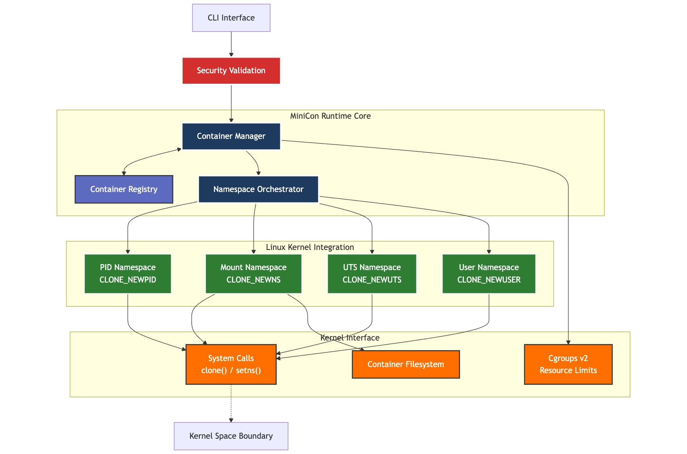

# MiniCon

**MiniCon** is a lightweight educational container runtime implementation in Python that demonstrates core virtualization concepts from ["Operating Systems: Three Easy Pieces" by Remzi H. Arpaci-Dusseau and Andrea C. Arpaci-Dusseau](https://pages.cs.wisc.edu/~remzi/OSTEP/) with production-quality code standards.

## ⚠️ Not for Production

This project is designed for **learning container internals** and demonstrates production-quality implementation patterns. While feature-complete for educational purposes, it lacks some enterprise features needed for production container workloads (e.g., network namespaces, advanced cgroup controls, OCI compliance).

## Overview



MiniCon provides a minimal container runtime that focuses on:

- **Process isolation** using Linux namespaces (PID, Mount, UTS, User)
- **Filesystem isolation** with secure mount operations
- **Resource constraints** using cgroups
- **Secure container lifecycle management** with input validation
- **Clean architecture** for understanding container internals

## Learning Objectives

This project provides hands-on experience with:

- **Linux namespace types**: PID, Mount, UTS, and User namespaces
- **Secure containerization**: Input validation and safe system operations
- **Filesystem isolation**: chroot and mount namespace management
- **Resource management**: Memory limits and cgroup controls
- **Container lifecycle**: Creation, execution, monitoring, and cleanup
- **Security principles**: Preventing shell injection and path traversal attacks

## Requirements

- Linux-based system (MiniCon is NOT cross-platform and works ONLY on Linux)
- Python 3.11+
- Root privileges (for namespace operations)

## Installation & Usage

### Basic Setup

```bash
# Install dependencies
poetry install

# Run MiniCon CLI
poetry run python -m src.cli --help
```

### Development Commands

```bash
# Setup development environment
make setup-dev

# Code quality checks
make format    # Format code with black and isort
make lint      # Run flake8 and mypy

# Run test suite
make test      # Run all tests with pytest
```

### Example Usage

```bash
# Create a container
sudo poetry run python -m src.cli create my-container /bin/bash

# Start the container
sudo poetry run python -m src.cli start <container-id>

# List containers
sudo poetry run python -m src.cli list
```

## Features

### Container Runtime
- **Core Architecture**: Container model, registry, and namespace orchestration
- **Namespace Isolation**: Complete PID, Mount, UTS, and User namespace implementations
- **Resource Management**: Memory limits via cgroups v2
- **Container Lifecycle**: Create, start, stop, remove operations with proper cleanup
- **CLI Interface**: Full command-line interface with Rich formatting and error handling

### Security & Safety
- **Input Validation**: Container names and commands validated against injection attacks
- **Path Sanitization**: All filesystem operations use secure path validation
- **Command Filtering**: Dangerous system commands blocked by default
- **Secure Execution**: subprocess instead of shell execution prevents command injection
- **Safe System Operations**: Proper error handling and resource cleanup

### Code Quality & Testing
- **Type Safety**: 100% MyPy type coverage with strict configuration
- **Test Coverage**: 142 comprehensive tests across unit, integration, and security validation
- **Code Standards**: Zero flake8 violations, Black/isort formatting
- **Documentation**: Extensive docstrings and architectural documentation

## Security & Safety

MiniCon implements several security measures for safe learning environments:

- **Input Validation**: Container names and commands are validated to prevent injection attacks
- **Path Sanitization**: All filesystem operations use secure path validation
- **Command Safety**: Dangerous system commands are blocked by default
- **Secure Execution**: Uses `subprocess` instead of shell execution to prevent command injection
- **Resource Limits**: Memory constraints prevent resource exhaustion

## Configuration

MiniCon uses environment variables for configuration:

- `MINICON_BASE_DIR`: Base directory for container data (default: `/var/lib/minicon`)
- `MINICON_MEMORY_LIMIT`: Default memory limit in bytes (default: 250MB)
- `MINICON_REGISTRY_FILE`: Container registry filename (default: `containers.json`)
